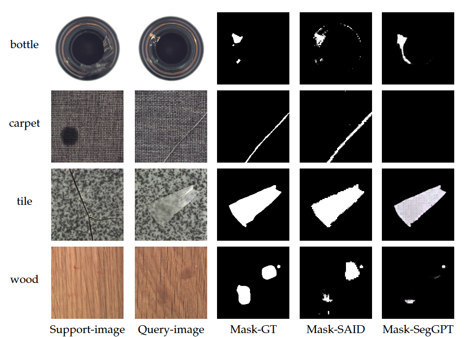

# SAID: Segment All Industrial Defects Model with Scene Prompt

We will be showcasing the details of our work here in the subsequent sections.

## Methodology

Our approach, as illustrated in the diagram `./img/one-model-final2.png`, utilizes a pair of annotated sample prompts to assist in the localization and segmentation of image defects.

## Model Architecture

The structure of our model is depicted in the diagram `./img/fig2_lw_fusion.png`.

## Results

Our results can be viewed in the image `./img/result.png`.

